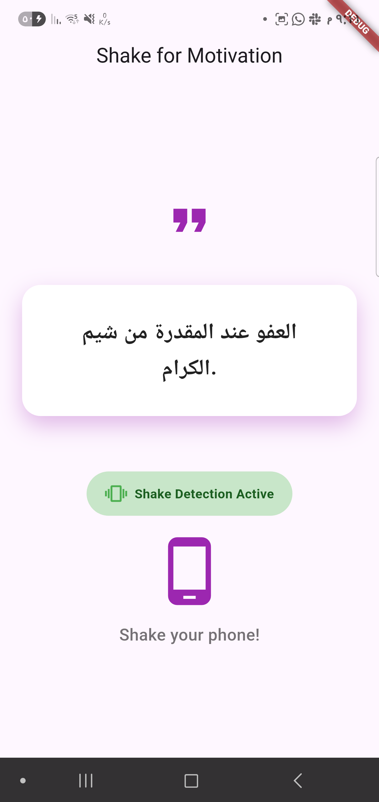
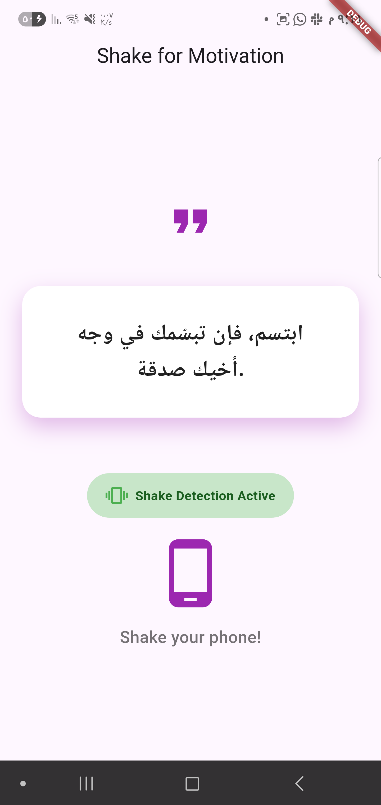
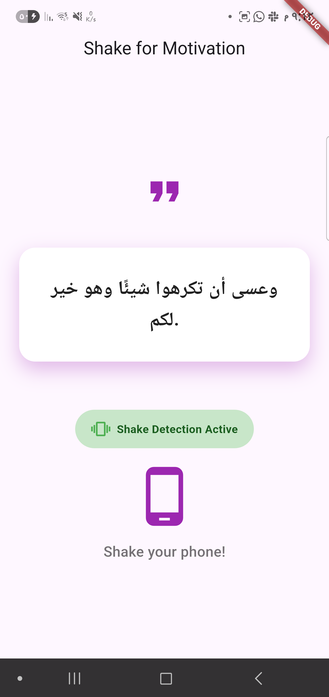

<h1 align="center">Shake App</h1>
<p align="center">
  
</p>

<p align="center">
  <strong>A Flutter application that provides motivational quotes upon shaking the device.</strong><br>
  Built with Flutter, utilizing platform channels for native shake detection.
</p>

<p align="center">
  <a href="#about">About</a> •
  <a href="#features">Features</a> •
  <a href="#project-structure">Project Structure</a> •
  <a href="#getting-started">Getting Started</a> •
  <a href="#technologies">Technologies</a> •
  <a href="#contributing">Contributing</a> •
  <a href="#license">License</a>
</p>

---

## About

Welcome to **Shake App** — a simple yet engaging Flutter application designed to deliver motivational quotes with a physical interaction. This app demonstrates the use of Flutter's platform channels to communicate with native Android code for accelerometer-based shake detection.

Users can shake their device to receive a new motivational quote, presented with a subtle animation for a delightful user experience. The project focuses on clear separation of concerns and efficient handling of native device features within a Flutter environment.

---

## Features

### 🌟 Core Functionality

- **Shake Detection**: Utilizes the device's accelerometer to detect shake gestures.
- **Motivational Quotes**: Displays a random motivational quote upon each detected shake.
- **Smooth Animations**: Quotes appear with scaling and fading animations for an enhanced UI.
- **Platform Channel Integration**: Seamless communication between Flutter (Dart) and native Android (Kotlin) code for sensor events.
- **Responsive UI**: Designed to provide a consistent experience across various device sizes.

---

## Project Structure

The project follows a standard Flutter project structure, with additional organization for platform-specific code and UI components.

```
lib/
├── main.dart                   # App entry point and main QuoteScreen widget
├── quote_service.dart          # Handles quote logic and platform channel communication
├── quote_display.dart          # Widget for displaying animated quotes
└── shake_status_indicator.dart # Widget for displaying shake detection status

android/
└── app/
    └── src/
        └── main/
            └── kotlin/
                └── com/
                    └── mhsensei/
                        └── shake_app/
                            ├── MainActivity.kt   # Handles FlutterEngine setup and method/event channels
                            └── ShakeDetector.kt  # Native Kotlin class for accelerometer-based shake detection
```

---

## 🚀 Getting Started

To get a local copy up and running, follow these simple steps.

### Prerequisites

- Flutter SDK: [Installation Guide](https://flutter.dev/docs/get-started/install)
- Android Studio (for Android development) or VS Code with Flutter extensions.

### Installation

1.  Clone the repo:
    ```bash
    git clone https://github.com/MostafaSensei106/shake_app.git
    ```
2.  Navigate to the project directory:
    ```bash
    cd shake_app
    ```
3.  Install dependencies:
    ```bash
    flutter pub get
    ```
4.  Run the app:
    ```bash
    flutter run
    ```

---

## 🖼️ Screenshots

| Screenshot 1                                                      | Screenshot 2                                                      |
| ----------------------------------------------------------------- | ----------------------------------------------------------------- |
|  |  |
|  |                                                                   |


---

## Technologies

This project is built with a modern tech stack for Flutter development:

| Technology          | Description                                                                      |
| ------------------- | -------------------------------------------------------------------------------- |
| 🐦 **Flutter**      | [flutter.dev](https://flutter.dev) — The core framework for building the UI.     |
| 🎯 **Dart**         | The programming language for Flutter.                                            |
| 🤖 **Kotlin**       | Used for native Android shake detection logic.                                   |
| 🔌 **MethodChannel** | For invoking methods from Dart to native Android.                                |
| ⚡ **EventChannel**  | For streaming events (shake detection) from native Android to Dart.               |

---

## Contributing

Contributions are what make the open-source community such an amazing place to learn, inspire, and create. Any contributions you make are **greatly appreciated**.

1.  Fork the Project
2.  Create your Feature Branch (`git checkout -b feature/AmazingFeature`)
3.  Commit your Changes (`git commit -m 'Add some AmazingFeature'`)
4.  Push to the Branch (`git push origin feature/AmazingFeature`)
5.  Open a Pull Request

---

## License

Distributed under the MIT License. See `LICENSE` for more information.

---

<p align="center">
  Made with ❤️ by <a href="https://github.com/MostafaSensei106">MostafaSensei</a>
</p>